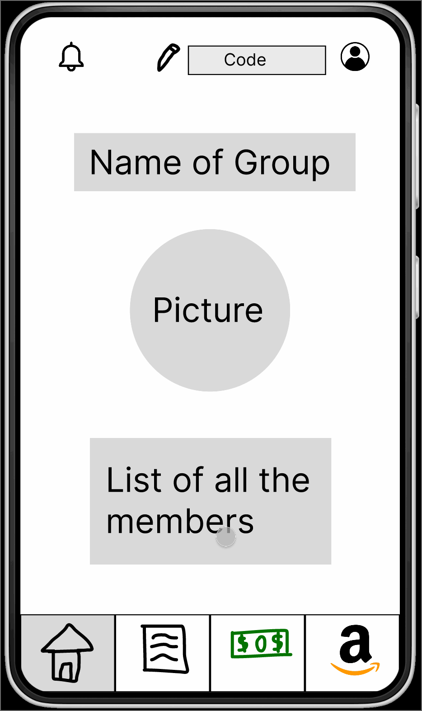

# Milestone 1 - roomies

## Table of Contents

1. [Overview](#Overview)
1. [Product Spec](#Product-Spec)
1. [Wireframes](#Wireframes)

## Overview

### Description

Join along with your roommates to split costs on Amazon items instantly, alert of incoming guests, assign chores, and set alerts. 

### App Evaluation

- **Category:** Budgeting- don't wait for reinbursement from a  friend, split at checkout time.
- **Mobile:** Real-time notifications for rent-due, incoming guests, purchases made.
- **Story:**  Roommates can hold each other accountable and the risk of disagreements on spending and workload is minimized.
- **Market:** College students/young adults living in apartments with more than 1 person. 1/3 of Americans have roommates.
- **Habit:** Daily check-ins for notifications (items added to wishlist, chore updates, etc)
- **Scope:** V1 would allow rent notifications, incoming guest notifications, chores to-do list, and splitting costs. V2 will charge users to a “virtual wallet” that will order the items on Amazon.

## Product Spec

### 1. User Features (Required and Optional)

**Required Features**

* User can create account
* Login screen to join correct roommate portal 
* Live bell notifications to alert others of incoming guests
* To-Do chore list you can assign to specific group members
* Wishlist of amazon products and estimated cost per household member

**Stretch Features**

* Create a "virtual wallet" to split costs directly at checkout time from two wallets in Amazon
* Location sharing for safety/security

### 2. Screen Archetypes

- Login Screen
  - user can login to correct roommate portal
- Registration Screen
  - user can create a new account
- Stream
  - user can view chores to-do list 
  - user can view notification 
  - user can view Amazon wishlist
- Creation
  - user can add to chores to-do list
  - user can add an event to be notified of
  - user can add to Amazon wishlist
- Search
  - user can search for Amazon items 

### 3. Navigation

**Tab Navigation** (Tab to Screen)

* Home Feed
* Chores To-do List
* Amazon Wishlist
* Notifications

**Flow Navigation** (Screen to Screen)

- Login Screen
  - => Home
- Registration Screen
  - => Home
- Stream Screen
  - => None
- Creation Screen
  - => Home - after adding chore/item
- Search Screen
  - => None

## Wireframes

### [BONUS] Digital Wireframes & Mockups

### [BONUS] Interactive Prototype

